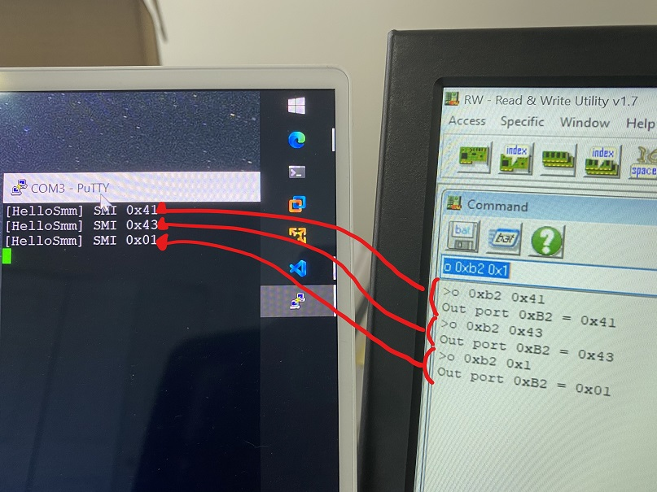
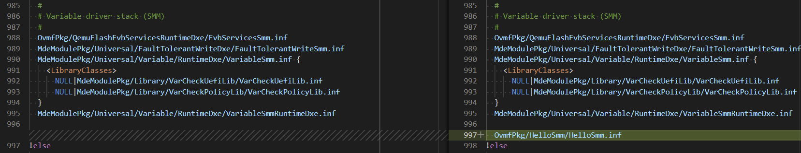
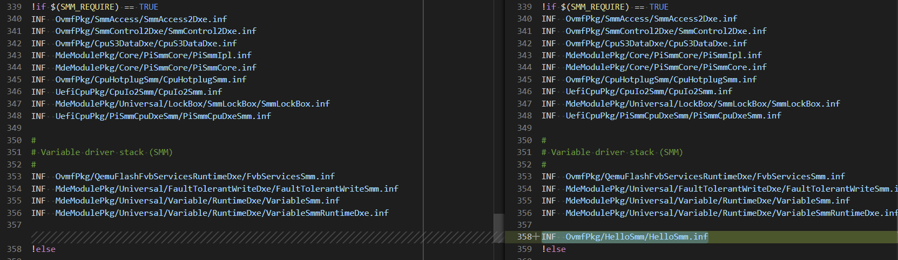
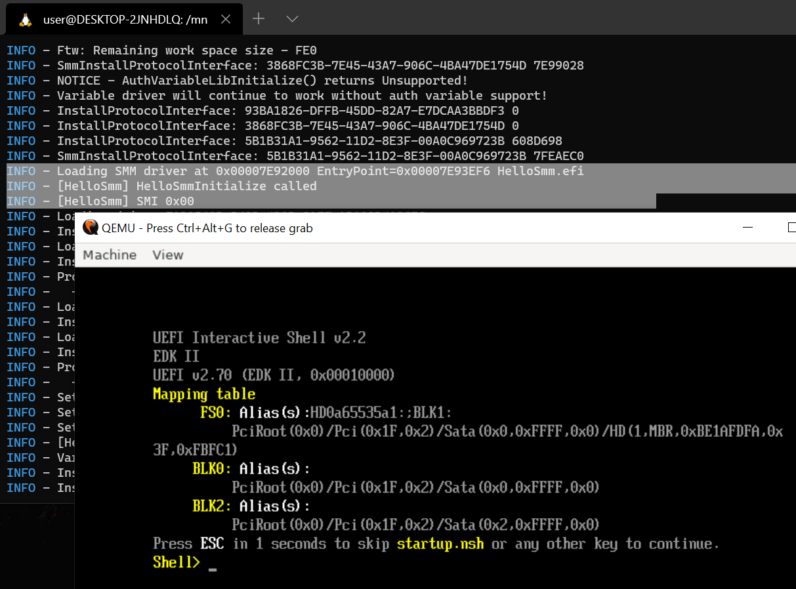
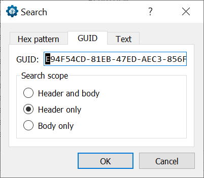
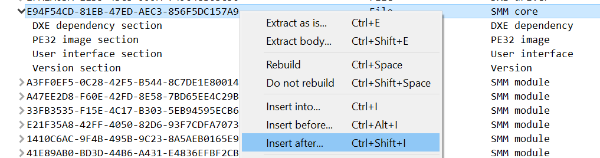
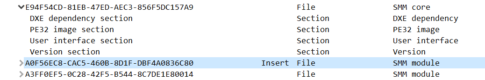
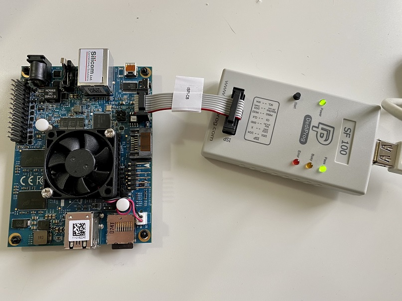
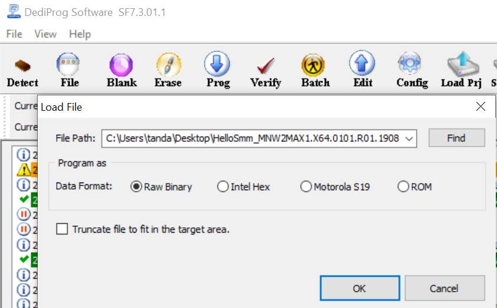
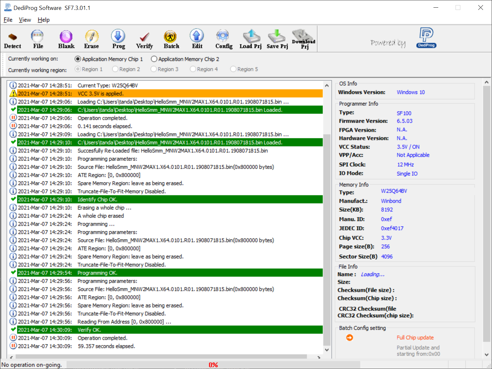

Building BIOS with a Custom SMM Module
=======================================

This is an instruction to run your own SMM code.

In this document, we will walk-through:
- building a custom SMM module as part of OVMF-based BIOS,
- loading the OVMF-based BIOS onto QEMU, and
- embedding the custom SMM module into existing device's BIOS.

HelloSmm is the custom SMM module used in this instruction. This SMM module receives any SMI and simply logs SMI command numbers ([video](https://youtu.be/FUtL6qV23T8))




Prerequisites
--------------

- Ubuntu host or Ubuntu on WSL.
- The target device with serial output. I use [MinnowBoard Turbot](https://store.netgate.com/Turbot4.aspx) and [SS-TTL3VT](https://www.amazon.ca/USB-to-3-3v-TTL-Header/dp/B004LBXO2A).
- The SPI programmer. I use [SF100](https://www.dediprog.com/product/SF100).
    - If you are going to test on QEMU only, those two are not required.


Outline
--------

High-level steps to test against a physical device are as follows:
1. Building the custom SMM module
2. Get the BIOS image and embed HelloSmm
3. Flash the modified BIOS image


Building the Custom SMM Module
-------------------------------

To build HelloSmm, first, check out the repositories:
```
$ git clone https://github.com/tandasat/HelloSmm.git
$ git clone -b edk2-stable202011 --recurse-submodules https://github.com/tianocore/edk2
$ cp -r HelloSmm/HelloSmm edk2/OvmfPkg
```

Open `edk2/OvmfPkg/OvmfPkgIa32X64.dsc` and add a dependency to HelloSmm.inf
```
  #
  # Variable driver stack (SMM)
  #
  ...
  OvmfPkg/HelloSmm/HelloSmm.inf
```


Similarly, open `edk2/OvmfPkg/OvmfPkgIa32X64.dsc` and add a a dependency to HelloSmm.inf
```
#
# Variable driver stack (SMM)
#
...
INF  OvmfPkg/HelloSmm/HelloSmm.inf
```


Then, build the BIOS image.
```
$ python3 -m venv ovmf_env
$ source ovmf_env/bin/activate
$ pip3 install --upgrade -r pip-requirements.txt
$ sudo apt-get install mono-complete

$ cd edk2/
$ stuart_setup -c OvmfPkg/PlatformCI/PlatformBuild.py TOOL_CHAIN_TAG=GCC5 -a IA32,X64
$ stuart_update -c OvmfPkg/PlatformCI/PlatformBuild.py TOOL_CHAIN_TAG=GCC5 -a IA32,X64
$ python3 BaseTools/Edk2ToolsBuild.py -t GCC5
$ stuart_build -c OvmfPkg/PlatformCI/PlatformBuild.py -a IA32,X64 TOOL_CHAIN_TAG=GCC5 BLD_*_SMM_REQUIRE=1 BLD_*_DEBUG_ON_SERIAL_PORT=1
```
(If you are going test on QEMU, omit `BLD_*_DEBUG_ON_SERIAL_PORT=1` in the last command.)

The above steps install dependencies under the virtual environment called `ovmf_env`, and build the OvmfPkg package for 32bit PEI, 64bit DXE (including HelloSmm) as `edk2/Build/Ovmf3264/DEBUG_GCC5/FV/OVMF.fd`.


Testing on QEMU
----------------

Simply, start QEMU with the compiled BIOS.
```
# If you are on WSL, install vcxsrv (https://sourceforge.net/projects/vcxsrv/)
# and start XLaunch first, then:

$ export DISPLAY=0:0
$ stuart_build -c OvmfPkg/PlatformCI/PlatformBuild.py -a IA32,X64 TOOL_CHAIN_TAG=GCC5 BLD_*_SMM_REQUIRE=1 --FlashOnly
```

You should see multiple SMI 0x00 logged by the HelloSMM.



Testing on a physical device
-----------------------------

To test on the physical device, get the BIOS image of the target device first by either,
- using a SPI programmer to keep the current BIOS, or
- downloading a BIOS image if available

Next, embed the compiled custom SMM module into the BIOS image.

1. Download [UEFITool](https://github.com/LongSoft/UEFITool/releases) with the old engine. The latest version is 0.28.0 as of this writing.
2. Open the base BIOS image and search `E94F54CD-81EB-47ED-AEC3-856F5DC157A9`
    - 
3. Right click, and `Insert after..`
    - 
4. Select `edk2/Build/Ovmf3264/DEBUG_GCC5/FV/Ffs/A0F56EC8-CAC5-460B-8D1F-DBF4A0836C80HelloSmm/A0F56EC8-CAC5-460B-8D1F-DBF4A0836C80.ffs`
    - 
5. Save the modified BIOS image.

Finally, wite the modified BIOS image onto the target device.

1. Physically connect the SPI programmer with the target.
    - 
2. Start DediProg Engineering, click the `File` button, and select the modified BIOS image.
    - 
3. Click `Batch` button to write the image to the SPI flash.
    - 
4. Disconnect the programmer from the device.

To verify your custom SMM is loaded and active, connect to the target device through the serial port to view logs, then start the target device. You should see SMI is logged onto the serial session. Easy😻


References
-----------

- Building OVMF - https://github.com/tianocore/edk2/tree/master/OvmfPkg/PlatformCI
- About mono dependency -https://listman.redhat.com/archives/edk2-devel-archive/2020-August/msg00823.html
